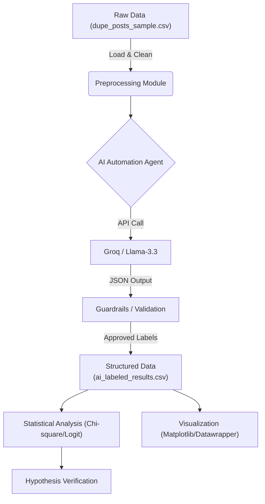

# Research Pipeline Demo: Text-based Analysis of “Dupe” Product Consumption
> **Project Focus:** Purchase Intention & Motivational Drivers (Hedonic vs. Utilitarian)

This repository serves as a **technical demonstration** for my PhD research proposal. It showcases the statistical analysis pipeline used to quantify consumer behaviors regarding "dupe" (alternative) products.

> **⚠️ Note on Source Code:**
> This represents the **public demonstration layer** of the project.
> The upstream **AI Automation Agent** (the core engine responsible for data fetching and LLM-based labeling) is maintained in a **private repository** to protect the intellectual property of an ongoing longitudinal study.
> *Access to the full codebase can be provided to the admissions committee upon request.*

## 📂 Repository Contents

This repository is organized into three main modules:

### 1. Statistical Analysis (Hypothesis Testing)
* `analysis_demo.py`: The core script that executes **Chi-square tests** and **Logistic Regression** to validate H1 based on the AI-labeled data.

### 2. Traditional NLP Pipeline (Study 1 Exploration)
* `src/dupe_pipeline/`: Source code for the modular text-mining workflow.
    * `config.py`: Centralized configuration for file paths and parameters (ensuring portability).
    * `data_io.py`: Handles robust data loading and export operations.
    * `cleaning.py`: Implements Regex cleaning and Chinese tokenization (using `jieba`).
    * `run_pipeline.py`: Orchestrator script that ties all modules together to produce frequency analysis.

### 3. Data & Reporting
* `data/raw/`:
    * `dupe_posts_sample.csv`: The initial raw dataset containing simulated social media posts generated for demonstration purposes.
* `data/processed/`:
    * `ai_labeled_results.csv`: **[Primary Data]** The dataset annotated by the AI Agent with 'Hedonic' vs 'Utilitarian' labels.
    * `dupe_posts_cleaned.csv`: Intermediate tokenized data ready for topic modeling.
* `reports/`:
    * `figures/word_freq_top.png`: Visualization of top keywords identified in the corpus.
    * `data_for_datawrapper.csv`: Aggregated frequency data exported specifically for external visualization tools.

## 🚀 Methodological Evolution (RP vs. Implementation)

While my original Research Proposal (RP) suggested using **Structural Topic Modeling (STM)**, this implementation upgrades the methodology to a **Generative AI approach** for higher semantic precision.

### Why this upgrade?
1.  **Precision:** Unlike keyword-based STM, LLMs can understand context (e.g., distinguishing "I want to buy" from "I bought it").
2.  **Efficiency (Groq Integration):** The system utilizes **Groq API** serving **Llama-3.3-70b**. I chose Groq over proprietary models (like Gemini/GPT-4) to leverage the **open-weights nature of Llama-3** (better for academic reproducibility) and to overcome API rate limits for high-throughput batch processing.

## 🧠 The AI Labeling Mechanism

To ensure that the labeled data used in this demo remains scientifically credible and reproducible, the upstream private agent adopts the following controlled labeling procedure:

1.  **Zero-shot Classification:** The model classifies text without needing thousands of training examples, using advanced prompt engineering.
2.  **JSON Schema Enforcement:** Instead of letting the AI "chat," we force it to output strict computer-readable code (JSON).
3.  **Deterministic Output (Temp=0):** We set the model's "creativity" to zero. This ensures that if you run the same data twice, you get the exact same result-crucial for scientific replication.



## 📊 Key Findings (Hypothesis 1 Verification)

The pipeline successfully verifies **Hypothesis 1 (H1)**: *Hedonic motivation drives higher purchase intention for dupes than utilitarian motivation.*

| Motivation Type | Purchase Rate | Sample Size |
| :--- | :--- | :--- |
| **Hedonic** | **91.84%** | 49 |
| **Utilitarian** | **50.00%** | 50 |

* **Statistical Significance:** $\chi^2 = 20.91$, $p < 0.001$ (Highly Significant).
* **Logistic Regression:** The coefficient for Hedonic motivation is **2.42**, indicating a strong positive predictor for purchase intent.

## 🛠️ How to Run

1. **Install dependencies:**
   Run the following command in your terminal to install the necessary Python packages:
   ```bash
   pip install -r requirements.txt
   ```

2. **Run the analysis demo:**
    Run the following command in your terminal:
    ```bash
    python analysis_demo.py
    ```

3. **View Results:**
    The script will output the sample size, purchase rates, and Chi-square statistics directly in the terminal console.

## 📦 Requirements

* numpy==2.3.5
* packaging==25.0
* pandas==2.3.3
* patsy==1.0.2
* python-dateutil==2.9.0.post0
* pytz==2025.2
* scipy==1.16.3
* six==1.17.0
* statsmodels==0.14.6
* tzdata==2025.2

## 📄 License

This project is licensed under the **MIT License** ➡️ see the [LICENSE](LICENSE) file for details.

---
**Contact:**
If you wish to review the full source code of the automation agent, please contact:
**Meng-Jen (Miya) Lin**
*National Taiwan Normal University*<br>
*Email: mengjen.miya.lin@gmail.com*